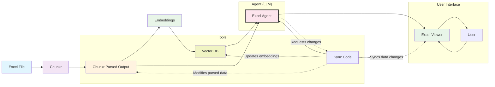

## Overview

An Excel agent combines Chunkr's parsing power with an interactive viewer and LLM capabilities. Users can view native Excel cells, search for tables, and let the LLM read/write to specific cell ranges while keeping everything synchronized.

## Architecture

## How It Works

### 1. **Chunkr Output as Foundation**
- Chunkr parses the Excel file **once** into structured data
- The viewer renders native cells directly from this parsed output
- All components work with the same underlying data structure

### 2. **LLM Integration**
- **Read Operations**: LLM analyzes specific cell ranges for patterns and insights
- **Write Operations**: LLM requests data changes through the sync code
- **No Re-parsing**: Changes are made to existing parsed data, Chunkr doesn't re-parse

### 3. **Sync Code Coordination**
- Sync code is the central coordinator for all data modifications
- LLM sends change requests to sync code rather than modifying data directly
- Sync code updates parsed data, viewer, and vector DB embeddings simultaneously
- Ensures all components stay synchronized with a single source of truth

### 4. **Search & Discovery**
- Chunkr parsed output gets converted into embeddings for semantic understanding
- Vector DB stores these embeddings for efficient similarity search
- Enables semantic search for more intelligent data discovery
- LLM can quickly locate specific data ranges through natural language queries

## Example Workflow

1. **Upload Excel file** → Chunkr parses structure
2. **Create embeddings** → Convert parsed data to vectors for search
3. **View native cells** → Viewer displays from parsed output  
4. **Search for tables** → Find specific tables through natural language in vector DB
5. **LLM operations** → Read/write to cell ranges
6. **Auto-update** → Viewer reflects changes immediately

The agent acts as the central coordinator, ensuring seamless interaction between the user interface and the underlying tools while maintaining data consistency through the Chunkr output.

