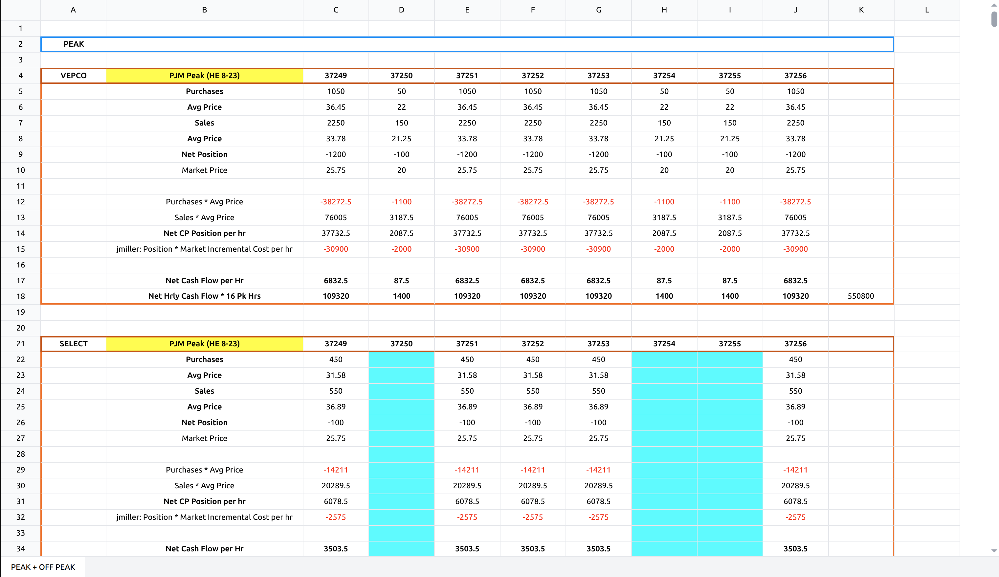

import BetaNote from '/snippets/beta-note.mdx';

<BetaNote/>

# Overview
 
The Chunkr Excel parser is the first of its kind, solving a major challenge in Excel processing for AI agents: 
providing LLMs with meaningful Excel context by breaking spreadsheets into semantically relevant elements.

The parser transforms Excel sheets into Chunkr's structured output format, automatically identifying and labeling distinct regions within each sheet. 
This intelligent segmentation enables more accurate data interpretation and processing.

<Frame caption="Financial spreadsheet showing Chunkr's intelligent segmentation">
  
</Frame>

# Using Chunkr with Excel Files

**Processing Excel files with Chunkr works exactly the same as regular files** - you use the same upload methods and APIs. The key difference is that Excel files return additional spreadsheet-specific fields in the output, providing rich Excel context that doesn't exist in PDF or other document formats.

## Excel Processing

Upload and process Excel files using the same methods as any other document:

<CodeGroup>
```python Python
from chunkr_ai import Chunkr

chunkr = Chunkr()

# Upload Excel file - same as any other file type
task = chunkr.upload("path/to/spreadsheet.xlsx")

# Access results - same output structure with Excel-specific fields
for chunk in task.output.chunks:
    for segment in chunk.segments:
        print(f"Segment type: {segment.segment_type}")
        
        # Excel-specific fields (only populated for Excel files)
        print(f"Sheet: {segment.ss_sheet_name}")
        print(f"Range: {segment.ss_range}")
```

```bash cURL
curl -X POST https://api.chunkr.ai/api/v1/task/parse \
  --header "Authorization: YOUR_API_KEY" \
  --header "Content-Type: application/json" \
  --data '{
    "file": "url_or_base64_encoded_excel_content",
    "file_name": "spreadsheet.xlsx"
  }'
```
</CodeGroup>

## Configuration

Excel files support all the same configuration options as regular documents. You can customize:

- **Segment Processing**: How tables, charts, and text are processed
- **Chunk Processing**: How content is chunked for RAG applications  
- **LLM Processing**: Custom prompts for any segment
- **Error Handling**: How to handle processing errors in complex spreadsheets

For detailed configuration options and Excel-specific recommendations, see [Excel Configuration](/docs/excel-parser/configuration).

## What Makes Excel Different

While the processing approach is identical, Excel files provide additional context through **`ss_` (spreadsheet-specific) fields**:

| Field | Description |
|-------|-------------|
| `ss_sheet_name` | Name of the worksheet containing the segment |
| `ss_range` | Excel cell range (e.g., "A1:D10") |
| `ss_cells` | Individual cell data including formulas and values |
| `ss_header_range` | Range of header cells for tables |

These fields enable Excel-specific capabilities that don't apply to other document types:
- **Multi-sheet context**: Know which worksheet each segment comes from
- **Cell-level precision**: Access individual cell formulas, values, and styling
- **Table structure**: Understand header relationships and data organization

## Next Steps

- **[Understanding the Output](/docs/excel-parser/understanding-the-output)**: Learn about Excel-specific response fields
- **[Configuration](/docs/excel-parser/configuration)**: Detailed configuration options for Excel files

