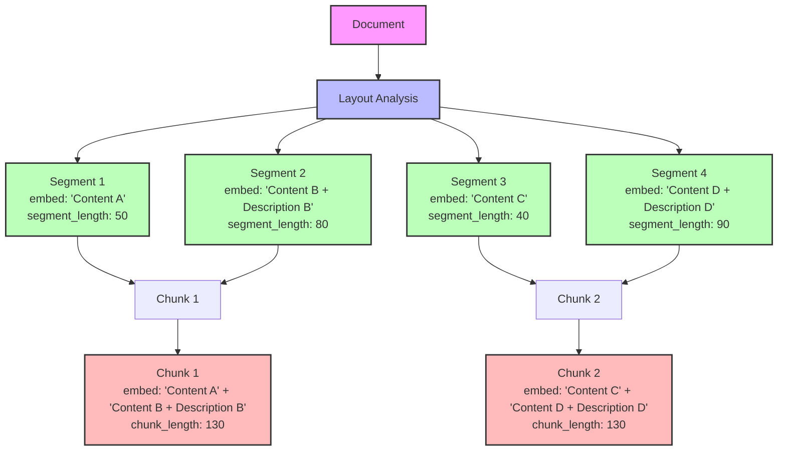

Chunking is the process of splitting a document into smaller segments.
These chunks can be used for semantic search, and better LLM performance.

By leveraging layout analysis, we create intelligent chunks that preserve document structure and context. Our algorithm:

- Respects natural document boundaries (paragraphs, sections)
- Maintains semantic relationships between segments
- Optimizes chunk size for LLM processing

Here is an example that will chunk the document into 4096 tokens per chunks for OpenAI models. These values are also the defaults, so you don't need to specify them.

<CodeGroup> 
```python Python
from chunkr_ai import Chunkr
from chunkr_ai.models import (
    ChunkProcessing,
    Configuration
    Tokenizer,
)

chunkr = Chunkr()

chunkr.upload("path/to/file", Configuration(
chunk_processing=ChunkProcessing(
    target_length=Cl100kBase,
    tokenizer=Tokenizer.CL100K_BASE
  ),
))
````

```bash cURL
curl --request POST \
  --url https://api.chunkr.ai/api/v1/task/parse \
  --header 'Authorization: YOUR_API_KEY' \
  --header 'Content-Type: application/json' \
  --data '{
    "file": "base64_encoded_file_content",
    "file_name": "document.pdf",
    "chunk_processing": {
      "target_length": 4096,
      "tokenizer": {
        "Enum": "Cl100kBase"
      }
    }
  }'
````

</CodeGroup>

### Defaults

- `target_length`: 4096
- `tokenizer`: `Cl100kBase`

## Tokenizer

Chunkr supports a large number of tokenizers. You can use our predefined ones or specify any tokenizer from huggingface.

### Predefined Tokenizers

The predefined tokenizers are enum values and can be used as follows:

<CodeGroup> 
```python Python
from chunkr_ai import Chunkr
from chunkr_ai.models import (
    ChunkProcessing,
    Configuration
    Tokenizer,
)

chunkr = Chunkr()

chunkr.upload("path/to/file", Configuration(
  chunk_processing=ChunkProcessing(
    tokenizer=Tokenizer.WORD
  ),
))

````

```bash cURL
curl --request POST \
  --url https://api.chunkr.ai/api/v1/task/parse \
  --header 'Authorization: YOUR_API_KEY' \
  --header 'Content-Type: application/json' \
  --data '{
    "file": "base64_encoded_file_content",
    "file_name": "document.pdf",
    "chunk_processing": {
      "tokenizer": {
        "Enum": "Word"
      }
    }
  }'
````

</CodeGroup>

Available options:

- `Word`: Split by words
- `Cl100kBase`: For OpenAI models (e.g. GPT-3.5, GPT-4, text-embedding-ada-002)
- `XlmRobertaBase`: For RoBERTa-based multilingual models
- `BertBaseUncased`: BERT base uncased tokenizer

### Hugging Face Tokenizers

Use any Hugging Face tokenizer by providing its model ID as a string (e.g. "facebook/bart-large", "Qwen/Qwen-tokenizer", etc.)

<CodeGroup> 
```python Python
from chunkr_ai import Chunkr
from chunkr_ai.models import (
    ChunkProcessing,
    Configuration
    Tokenizer,
)

chunkr = Chunkr()

chunkr.upload("path/to/file", Configuration(
  chunk_processing=ChunkProcessing(
    tokenizer="Qwen/Qwen-tokenizer"
  ),
))

````

```bash cURL
curl --request POST \
  --url https://api.chunkr.ai/api/v1/task/parse \
  --header 'Authorization: YOUR_API_KEY' \
  --header 'Content-Type: application/json' \
  --data '{
    "file": "base64_encoded_file_content",
    "file_name": "document.pdf",
    "chunk_processing": {
      "tokenizer": {
        "String": "Qwen/Qwen-tokenizer"
      }
    }
  }'
````

</CodeGroup>

## Calculating Chunk Lengths With Embed Fields

When calculating chunk lengths and performing tokenization, we use the text from the `embed` field in each chunk and segment object. This field contains the text that will be compared against the target length.

The content of the `embed` field is automatically calculated based on whether a description is generated for segments:
- If `description` is set to `true` for a segment type, the embed field will include both the `content` and the generated `description`
- If `description` is set to `false` or not specified, the embed field will contain only the `content`


Here's an example of enabling descriptions for Picture segments, which will include both the content and description in the embed field when calculating lengths:

<CodeGroup> 
```python Python    
from chunkr_ai import Chunkr
from chunkr_ai.models import (
    Configuration,
    SegmentProcessing,
    GenerationConfig,
)

chunkr = Chunkr()

chunkr.upload("path/to/file", Configuration(
    segment_processing=SegmentProcessing(
        Picture=GenerationConfig(
            description=True
        )
    )
))

````

```bash cURL
curl --request POST \
  --url https://api.chunkr.ai/api/v1/task/parse \
  --header 'Authorization: YOUR_API_KEY' \
  --header 'Content-Type: application/json' \
  --data '{
    "file": "base64_encoded_file_content",
    "segment_processing": {
      "Picture": {
        "description": true
        }
    }
  }'
````

</CodeGroup>

This means for this configuration, when calculating chunk lengths:

- Picture segments: Length will be based on both the content and generated description (since `description: true`)
- Table segments: Length will be based on both the content and generated description (since `description: true` is the default)
- All other segments: Length will be based only on the content (since `description` is not specified)
- The tokenizer will be `CL100K_BASE` (default)

The automatic embed field calculation ensures optimal chunking while preserving important descriptive information when available.

## How Segments Become Chunks

Understanding how individual segments are combined into chunks is crucial for optimizing your chunking strategy. Here's how the process works:

### Segment to Chunk Flow

1. **Individual segments** are created from document layout analysis
2. Each segment gets its own `embed` field (content only, or content + description)
3. Segments are **grouped together** based on the target chunk length
4. All segment `embed` fields in a group are **concatenated** to form the chunk's `embed` field
5. The `chunk_length` represents the tokenized length of this concatenated content

This approach ensures that chunk lengths accurately reflect all the text content (including any generated descriptions) that will be used for semantic search and LLM processing.

### Visual Example

The following diagram illustrates how segments are combined into chunks, showing how embed fields are concatenated and lengths are calculated:



In this example:
- **Segments 1 & 3** have only content in their embed fields (no description enabled)
- **Segments 2 & 4** have content + description in their embed fields (description enabled)
- **Chunk 1** combines Segments 1 & 2, concatenating their embed fields
- **Chunk 2** combines Segments 3 & 4, concatenating their embed fields
- The final chunk lengths (130 tokens each) reflect the total tokenized length of the concatenated embed content
