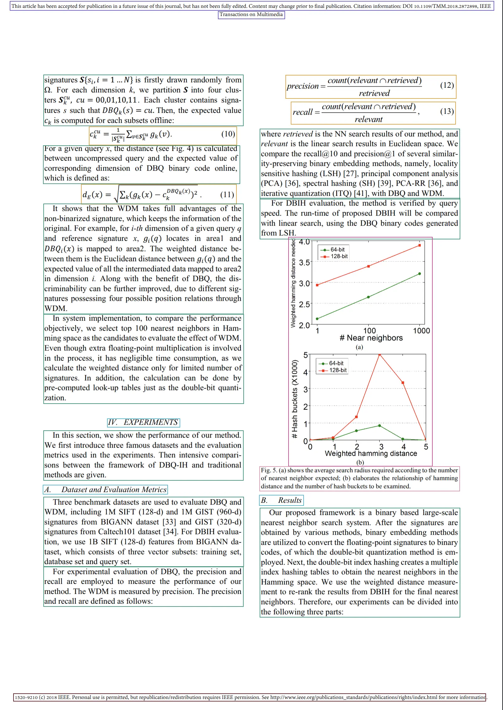

Layout analysis is a crucial step in document processing that involves analyzing and understanding the spatial arrangement of content within a document. 
It helps identify and classify different regions of a document, such as `text`, `table`, `headers`, `footers`, and `pictures`.

Basically, it tells us where and what is in the document.

## Why is Layout Analysis Important?

Layout analysis serves several key purposes:
- **Structure Recognition**: It helps identify the logical structure and reading order of a document
- **Data Extraction**: By identifying specific regions (like tables, headers, or paragraphs), we can use specialized extraction methods for each type, improving accuracy
- **Better Chunking**: Layout elements allows us to identify sections of the document and generate better chunks.
- **Citations**: It allows LLMs to cite the correct region of the document, which can then be highlighted for a better experience.

## Segment Types

Chunkr uses a two way vision-grid transformer to identify the layout of the document.
We support the following segment types:

- **Caption**: Text describing figures, tables, or other visual elements
- **Footnote**: References or additional information at the bottom of pages
- **Formula**: Mathematical or scientific equations
- **List Item**: Individual items in bulleted or numbered lists
- **Page**: Entire page (`segmentation_strategy=Page`)
- **Page Footer**: Content that appears at the bottom of each page
- **Page Header**: Content that appears at the top of each page
- **Picture**: Images, diagrams, or other visual elements
- **Section Header**: Headers that divide the document into sections
- **Table**: Structured data arranged in rows and columns
- **Text**: Regular paragraph text
- **Title**: Main document title

