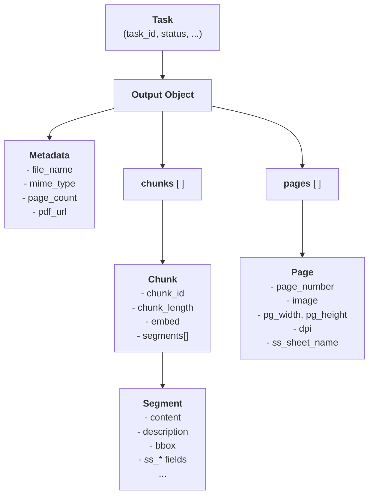

import { Frame, CodeGroup, Note, Card, CardGroup } from '@mintlify/components';

This guide breaks down the key components of the response, helping you leverage the full power of our parsing engine.

## High-Level Structure

<Frame>

</Frame>

<b>Parse</b> returns a `Task` object. When processing is successful, the `output` field contains the structured representation of your document. The core of this output is a list of `chunks`, which are composed of individual `segments`.

<CodeGroup>
```json Top-Level Output
{
  "task_id": "8b7e7e8a-...",
  "status": "Succeeded",
  "output": {
    "file_name": "document.pdf",
    "page_count": 2,
    "chunks": [
      // ... array of chunk objects
    ],
    "pages": [
      // ... array of page objects with full-page images
    ]
  },
  // ... other task metadata
}
```
</CodeGroup>

### Chunks and Segments

The document is first broken down into `segments`, which represent individual semantic elements like a paragraph, table, or title. These segments are then grouped into `chunks` based on your chunking configuration.

- **Segments**: The smallest building blocks. Each segment corresponds to a single, identified element from the source document.
- **Chunks**: A logical grouping of one or more segments. Each chunk includes a `chunk_length` field indicating its token count. For RAG applications, chunks are the units of information that are typically embedded and retrieved.

The supported segment types are: `Caption`, `Footnote`, `Formula`, `ListItem`, `Page`, `PageFooter`, `PageHeader`, `Picture`, `SectionHeader`, `Table`, `Text`, and `Title`.

By default, chunking is set to XXXX tokens and the token counter is CLK100Base (compatible with OpenAI embeddings). (TBD might move to advanced readout on this page). 

## Key Output Fields

Each `segment` object contains rich information. Here are the most important fields to understand:

### 1. `content`

The `content` field holds the primary, structured representation of the segment. Each segment is formatted based on it's type.

- **Tables**: Converted to HTML to maintain complex col/row-span structure.
- **Images**: Converted to a robust text description, with charts/graphs including a tabular representation.
- **Formulas**: Converted to LaTeX strings for perfect mathematical representation. They can even be embedded within an HTML table if a formula appears inside a cell.
- **Text-type**: Text-heavy segment like title, section headers and text blocks are converted into markdown.

<CodeGroup>
```json Segment with HTML Table and LaTeX
{
  "segment_type": "Table",
  "content": "<table><tr><td>The formula is:</td><td>\\( E=mc^2 \\)</td></tr></table>"
}
```
</CodeGroup>

The `content` field is also available at the chunk level, where it concatenates the `content` of every segment within that chunk.

### 2. `description`

This field contains an LLM-generated summary of the segment's content. It's especially powerful for `Table` segments. By default - tables are the only segment type it's activated for. 

- **For Tables**: The description provides a natural language summary of the table's key insights, making it highly effective for semantic search and RAG.

<CodeGroup>
```json Segment with Description
{
  "segment_type": "Table",
  "description": "The table shows a 15% increase in Q2 revenue for Widget A compared to Q1, while Widget B saw a 50% increase.",
  "content": "<table>...</table>"
}
```
</CodeGroup>

### 3. `embed`

The `embed` field provides the clean, RAG-optimized text that should be used for generating embeddings.

- It includes the `content` and, if present, the `description`. This helps optimized the table segments without contaminating the content field.
- This is the field used for calculating token counts when chunking, ensuring chunks fit your target length.

<CodeGroup>
```json Chunk with embed field
{
  "chunk_id": "chunk-1-...",
  "chunk_length": 45,
  "embed": "The table shows a 15% increase in Q2 revenue for Widget A... | Product | Q1 | Q2 | ...",
  "segments": [ /* ... */ ]
}
```
</CodeGroup>

### 4. `bbox` (Bounding Box)

Every segment includes a precise bounding box (`bbox`) that pinpoints its exact location on the original page. This is essential for building applications that require citations or highlighting.

- The coordinates (`left`, `top`, `width`, `height`) are scaled relative to the `page_width` and `page_height` of the page the segment belongs to.
- The `dpi` field in the `pages` array indicates the resolution a page image was rendered at, allowing you to accurately map the `bbox` to a rendered image.

<CodeGroup>
```json Segment with Bounding Box
{
  "segment_type": "Text",
  "bbox": { "left": 100, "top": 250, "width": 500, "height": 50 },
  "page_number": 1,
  "page_width": 792,
  "page_height": 612
}
```
</CodeGroup>

## Spreadsheet-Specific Outputs (`ss_*`)

<Frame>
"Excel output example from viewer" 
</Frame>

When processing spreadsheet files (`.xlsx`, `.csv`), the output includes special `ss_*` prefixed fields that provide native Excel context along with all the previosuly mentioned outputs. 

- **`ss_range`**: The cell range in A1 notation (e.g., `A1:D10`).
- **`ss_cells`**: A detailed array of each cell in the segment, including its formula, value, and styling.
- **`ss_header_*`**: Fields related to the detected header of a table (`ss_header_range`, `ss_header_text`). This includes headers that can be distant from the table but are intelligently appended to maintain context. 
- **`ss_sheet_name`**: The name of the worksheet the segment came from. Each object in the top-level `pages` array also contains this field.

## Advanced Outputs