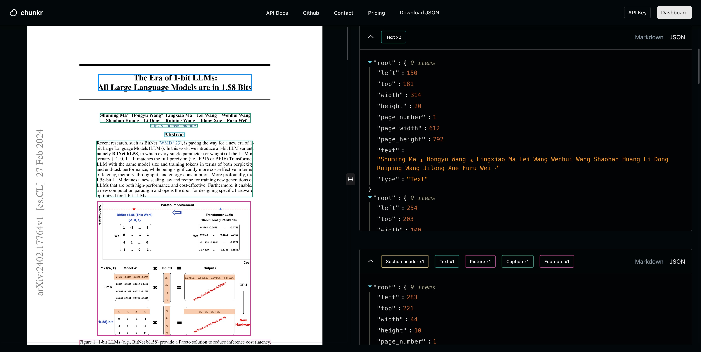

## Getting Started

Chunkr is a service for document layout analysis and chunking to convert documents into RAG/LLM-ready data. We use transformer based segmentation models and OCR models to extract bounding boxes and structured text from documents.

<CardGroup cols={2}>
  <Card title="Quickstart" icon="rocket" href="/quickstart">
    Get started with Chunkr API in minutes
  </Card>
  <Card title="API Reference" icon="book" href="/api-reference">
    Explore the complete API documentation
  </Card>
</CardGroup>
