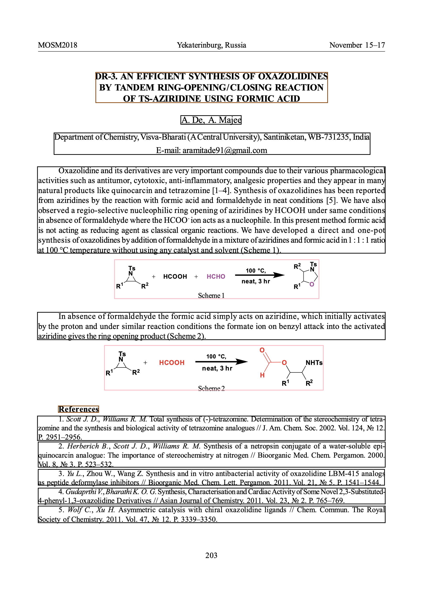

The ChunkMyDocs API processes documents by analyzing their layout and segmenting them into meaningful chunks suitable for Retrieval-Augmented Generation (RAG) and Large Language Models (LLMs). Understanding the distinction between **segments** and **chunks** is crucial for effectively utilizing the API.



## Segments vs. Chunks

- **Segments**: These are the fundamental building blocks extracted from the document. Each segment represents a specific part of the document, such as a title, section header, paragraph, list item, table, picture, caption, formula, footnote, page header, or footer. Segments are identified using unique identifiers, precise bounding boxes, and their content type.

- **Chunks**: Chunks are collections of one or more segments. They serve as higher-level groupings that can be used for various downstream applications like indexing, searching, or further analysis. The grouping of segments into chunks depends on the `target_chunk_length` parameter:

  - **No Chunking (`target_chunk_length = 0`)**: Each segment is treated as an individual chunk, maintaining a one-to-one relationship and preserving the original document structure without additional grouping.

  - **With Chunking (`target_chunk_length > 0`)**: Segments are grouped into chunks up to the defined length, excluding headers and footers to maintain content integrity. For example, with `target_chunk_length = 512`, each chunk can contain up to 512 words.

## Segment and Chunk Models

### Segment Model

The `Segment` model represents individual elements extracted from the document. It includes the following properties:

- `segment_id`: Unique identifier for the segment.
- `bbox`: Bounding box defining the segment's position on the page.
- `page_number`: Integer specifying the page number.
- `page_width`, `page_height`: Dimensions of the page.
- `content`: Text content of the segment.
- `segment_type`: Type of the segment (e.g., Title, Text, Table).
- `ocr`: Optional OCR results associated with the segment.
- `image`, `html`, `markdown`: Optional representations of the segment's content.

### Chunk Model

The `Chunk` model represents a collection of segments. It consists of:

- `segments`: An array of `Segment` objects.
- `chunk_length`: Integer specifying the length of the chunk in words.

For detailed schema information, please refer to the API documentation.

## Bounding Boxes and DPI

Accurate annotation of segments relies on precise bounding boxes, which are determined based on the document's DPI (Dots Per Inch). DPI affects the scaling and positioning of elements within the document:

- **Bounding Boxes**: Each segment has a bounding box defined by its top-left and bottom-right coordinates. These coordinates locate the segment within the page, ensuring that annotations and further processing align correctly with the original document layout.

- **DPI Considerations**: The DPI setting influences how bounding boxes are calculated. By default, all incoming files are scaled to 150 DPI, and bounding box coordinates are based on this scaling to maintain consistency.

## Annotating Segments and Chunks

Annotation involves visually highlighting segments within the document to provide clarity and facilitate further analysis. The `annotate.py` script is responsible for drawing bounding boxes around segments:

```python
import fitz  # PyMuPDF
from models import TaskResponse
import json

def draw_bounding_boxes(pdf_path: str, output_data: TaskResponse, output_path: str):
    color_map = {
        "Caption": (1, 0, 0),
        "Footnote": (0, 1, 0),
        "Formula": (0, 0, 1),
        "ListItem": (1, 1, 0),
        "PageFooter": (1, 0.5, 0),
        "PageHeader": (0.5, 0, 0.5),
        "Picture": (1, 0.75, 0.8),
        "SectionHeader": (0.6, 0.3, 0),
        "Table": (0.54, 0, 0),
        "Text": (0, 0, 0),
        "Title": (1, 0, 0)
    }

    pdf_document = fitz.open(pdf_path)

    for chunk in output_data.chunks or []:
        for seg in chunk.segments:
            page = pdf_document[seg.page_number - 1]
            rect = fitz.Rect(
                seg.bbox.top_left[0],
                seg.bbox.top_left[1],
                seg.bbox.bottom_right[0],
                seg.bbox.bottom_right[1]
            )
            color = color_map.get(seg.segment_type, (0, 0, 0))
            page.draw_rect(rect, color=color, width=1)

    pdf_document.save(output_path)
    pdf_document.close()
```

### How It Works

1. **Color Mapping**: Each segment type is assigned a specific color for easy differentiation during annotation.
2. **Processing Segments**: The script iterates through all chunks and their respective segments, drawing rectangles around each segment based on their bounding box coordinates.

By understanding and utilizing segments and chunks effectively, along with accurate bounding box annotations, you can leverage the ChunkMyDocs API to its full potential, enabling robust document analysis and processing workflows.

```

```
